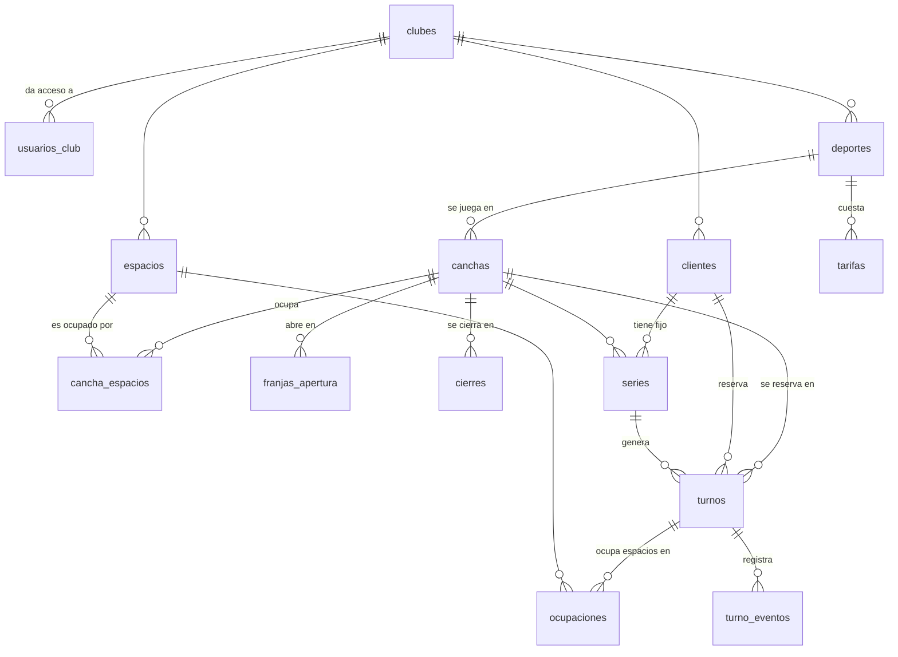

# El modelo de datos

Catorce tablas, en cuatro grupos. Ninguna de ellas es una traducción directa de
una pantalla: casi todas existen porque una decisión de
[docs/decisiones/](decisiones/) las exige. Cuando eso pasa, está anotado.

La regla general del modelo: **lo que el club decide se guarda, lo que se
deduce se calcula**. Un cierre por vacaciones se guarda porque alguien lo
decidió. Que la cancha grande no esté libre porque se vendió la chica no se
guarda: se deduce.

## El diagrama

## Grupo 1 — Quién entra

**`clubes`** es la unidad de aislamiento de todo el sistema
([ADR 0001](decisiones/0001-multi-tenant-modelo-pool.md)). Guarda además la
marca: logo y colores, porque el encargado tiene que ver su club en la
pantalla y no el nuestro. Y la zona horaria, que con turnos guardados como
instantes deja de ser un detalle cosmético.

**`usuarios_club`** conecta un usuario autenticado con los clubes a los que
tiene acceso, y con qué rol. Es la tabla contra la que se resuelven todas las
políticas de seguridad, así que es la que hay que probar primero. Que sea una
tabla intermedia y no una columna en el usuario deja abierto, sin costo, el
caso de la persona que administra dos clubes.

## Grupo 2 — Cómo es el club

Este grupo es la configuración que en el sistema anterior estaba escrita en el
código. Acá es data: por eso el alta de un club nuevo es cargar filas y no
desplegar una versión.

**`deportes`** define, sobre todo, cuánto dura un turno por defecto: el fútbol
por hora, el pádel por hora y media.

**`espacios`** y **`canchas`**, unidos por **`cancha_espacios`**, son el
corazón del modelo ([ADR 0003](decisiones/0003-espacios-compartidos.md)). La
cancha se vende, el espacio se ocupa. La cancha de fútbol 8 es una fila en
`canchas` con tres filas en `cancha_espacios`; cada cancha de fútbol 5 es una
fila con una. Un club sin canchas combinables tiene un espacio por cancha y
nunca piensa en esto.

**`franjas_apertura`** declara qué días y en qué horario abre cada cancha, con
vigencia. Es lo que reemplaza a la grilla pre-generada
([ADR 0002](decisiones/0002-agenda-sin-grilla-pregenerada.md)): los tres
patrones distintos de horarios de pádel del club anterior son, acá, tres filas.

**`cierres`** es el club decidiendo que algo no se puede reservar durante un
rango de tiempo: vacaciones, mantenimiento, lluvia, un evento privado. Puede
apuntar a una cancha o, con la cancha en nulo, al club entero. Es una decisión
explícita y por eso se guarda, a diferencia de la indisponibilidad que produce
una reserva vecina, que se deduce.

**`tarifas`** guarda el precio con vigencia, opcionalmente afinado por cancha y
por tipo de turno, que es como se le hace precio al fijo
([ADR 0005](decisiones/0005-precios-con-vigencia.md)).

## Grupo 3 — Quién juega

**`clientes`**, con clave interna y el teléfono normalizado como identificador
de negocio, único dentro del club
([ADR 0006](decisiones/0006-identidad-del-cliente.md)). La lista negra vive
acá, como una marca con motivo obligatorio: no es una baja, el historial se
conserva.

Lo que **no** hay en esta tabla son contadores. Turnos jugados, total aportado
y cancelaciones se calculan sobre los turnos
([ADR 0007](decisiones/0007-historia-en-eventos.md)).

## Grupo 4 — Qué pasa en las canchas

**`turnos`** es una fila por reserva concreta, con `inicio` y `fin` como
instantes. Guarda su tipo, su estado, el precio congelado, de qué serie viene
si viene de una, y —si se canceló— cuándo y quién.

**`series`** es la regla del fijo o la clase
([ADR 0004](decisiones/0004-fijos-como-serie.md)). Los turnos se materializan a
partir de ella con un horizonte de algunas semanas. Terminar la serie da de
baja el fijo; cancelar un turno es faltar una vez.

**`ocupaciones`** es la única tabla del modelo que nadie carga: la escribe un
trigger a partir de los turnos confirmados, una fila por espacio ocupado.
Existe por una sola razón, y es que ahí vive la restricción de exclusión que
hace imposible vender dos veces el mismo piso.

**`turno_eventos`** es la bitácora: qué le pasó a cada turno, cuándo y por
obra de quién.

## Lo que todavía no está

La función de disponibilidad —franjas de apertura, menos cierres, menos
ocupaciones, menos series vigentes no materializadas— es la pieza central del
sistema y **no** está escrita todavía. Va a ir en su propia migración, con sus
casos de prueba, porque es de lejos la parte con más chance de estar mal.

Las vistas de estadísticas tampoco. Primero hay que ver qué consultas pide de
verdad la pantalla; escribir vistas antes de eso es adivinar.
